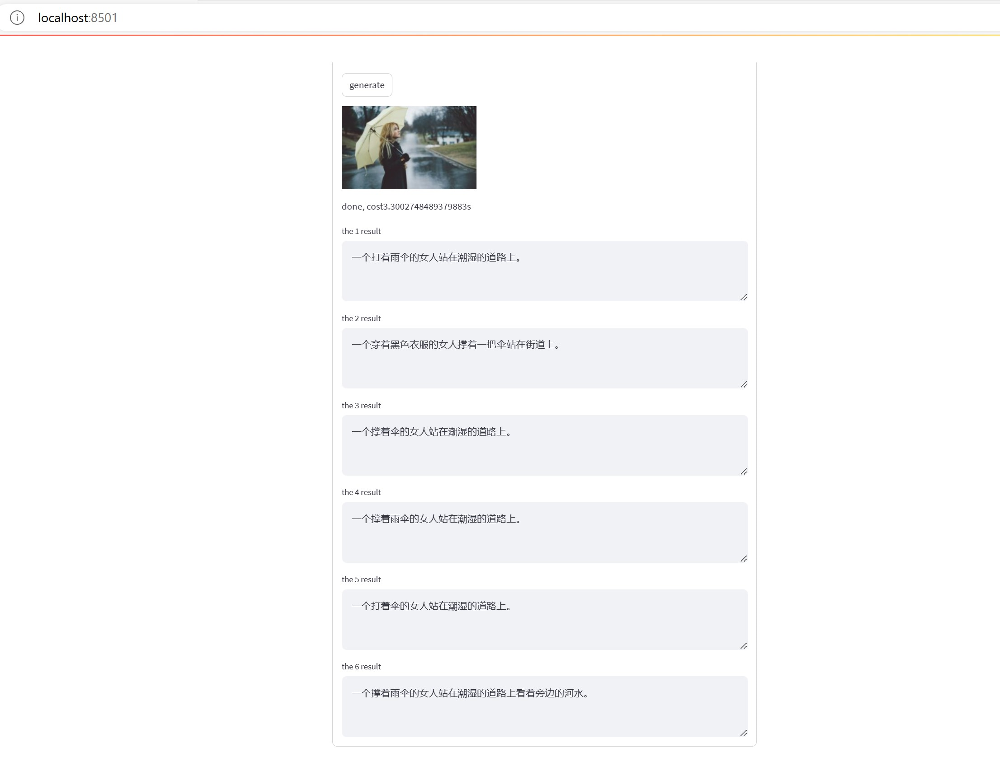

# Chinese Image Caption

This repo trained Chinese image caption model. The model use Encoder(VIT)-Decoder(GPT) architecture. I merged all AIGICC (train,val, test), Coco-CN(train,val, test) and flickr30k-cn(train,val, test) to train this model.



If you want to use the model and code, please refer to https://github.com/yaoxiaoyuan/mimix.

```
@misc{mimix,
  title={mimix},
  author={Xiaoyuan Yao},
  year={2021}
}
```

